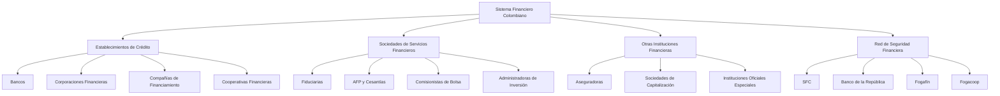

# Sistema Financiero Colombiano

## Definición general

> El **Sistema Financiero Colombiano** es el conjunto de instituciones, mercados y normas que facilitan la **intermediación financiera**, es decir, el proceso mediante el cual los recursos de los ahorradores se canalizan hacia los agentes que requieren financiación.

Su función principal es **movilizar el ahorro interno y externo** para promover el crecimiento económico, garantizando al mismo tiempo **estabilidad, confianza y solvencia** en las operaciones.

> 📘 Basado en el documento *“El Sistema Financiero Colombiano”* del **Banco de la República**.

---
## Objetivos principales

1. **Canalizar recursos financieros** entre unidades superavitarias (ahorradores) y deficitarias (inversionistas).
2. **Promover el desarrollo económico** mediante la financiación de proyectos productivos.
3. **Garantizar la estabilidad y solidez** del sistema a través de la regulación y supervisión.
4. **Proteger los intereses del público**, especialmente los depositantes e inversionistas.

---
## Organigrama general

---
## Estructura general del sistema financiero colombiano

El sistema financiero está compuesto por **tres grandes grupos de entidades** supervisadas por la **Superintendencia Financiera de Colombia (SFC)**:

| Grupo principal                         | Función principal                                                                | Ejemplos de entidades                                                                         |
| --------------------------------------- | -------------------------------------------------------------------------------- | --------------------------------------------------------------------------------------------- |
| **Establecimientos de crédito**         | Captar depósitos del público y otorgar créditos.                                 | Bancos, Corporaciones Financieras, Compañías de Financiamiento, Cooperativas Financieras      |
| **Sociedades de servicios financieros** | Administrar recursos o prestar servicios financieros sin intermediación directa. | Fiduciarias, AFP, Comisionistas de Bolsa, Almacenes de Depósito, Administradoras de Inversión |
| **Otras instituciones financieras**     | Complementar o apoyar la actividad financiera.                                   | Instituciones Oficiales Especiales, Sociedades de Capitalización, Aseguradoras                |

Además, existe una **Red de Seguridad Financiera**, integrada por entidades encargadas de **proteger la estabilidad del sistema**, como el **Banco de la República**, el **Fogafín**, el **Fogacoop** y la propia **SFC**.

---