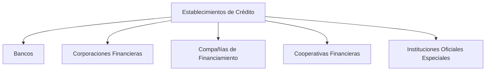

## Definición general

> Los **establecimientos de crédito** son instituciones financieras autorizadas para **captar dinero del público en forma de depósitos** y **colocarlo en operaciones de crédito** bajo su responsabilidad y por cuenta propia.

Constituyen la **columna vertebral del Sistema Financiero Colombiano**, ya que intermedian directamente entre los ahorradores y quienes necesitan financiación.

> 💡 Están vigilados por la **Superintendencia Financiera de Colombia (SFC)** y regulados por el **Estatuto Orgánico del Sistema Financiero (EOSF)**.

---

## Funciones principales

1. **Captar recursos** mediante depósitos a la vista, a término o de ahorro.  
2. **Otorgar créditos** de corto, mediano y largo plazo.  
3. **Canalizar el ahorro hacia la inversión productiva.**  
4. **Administrar instrumentos financieros** como cuentas corrientes, tarjetas, CDT, etc.  
5. **Contribuir a la política monetaria** mediante sus operaciones con el [[Banco de la República]].

---

## Clasificación de los establecimientos de crédito

El **EOSF** agrupa los establecimientos de crédito en las siguientes categorías:

| Tipo de entidad | Función principal | Ejemplo real |
|------------------|-------------------|---------------|
| **Bancos** | Captar recursos del público y otorgar créditos a todos los sectores. | Bancolombia, Davivienda, BBVA, Banco de Bogotá |
| **Corporaciones Financieras** | Financiar proyectos empresariales e inversiones de largo plazo. | Corficolombiana, Itaú Corpbanca Colombia |
| **Compañías de Financiamiento** | Especializadas en crédito de consumo o comercial; también financiamiento de bienes duraderos. | Tuya, RappiPay, Giros & Finanzas |
| **Cooperativas Financieras** | Intermediación financiera con base en la economía solidaria. | Coopcentral, Confiar, Cotrafa |
| **Instituciones Oficiales Especiales** | Entidades públicas con funciones específicas de fomento. | Bancoldex, Finagro, Findeter, Icetex |

---

## 1. Bancos

> Son las entidades más representativas del sistema financiero.  
> Se encargan de captar depósitos del público y destinarlos principalmente a operaciones de crédito.

### Funciones
- Apertura de cuentas corrientes y de ahorro.  
- Emisión de tarjetas débito y crédito.  
- Créditos personales, comerciales, hipotecarios y de consumo.  
- Servicios de tesorería, corresponsales bancarios y banca digital.  

**Ejemplo:** *Bancolombia*, *Banco de Bogotá*, *Davivienda*, *BBVA Colombia.*

---

## 2. Corporaciones Financieras

> Entidades orientadas a la **promoción y financiación de proyectos empresariales e industriales**, así como al **fortalecimiento del mercado de capitales**.

### Funciones
- Otorgar créditos de inversión a largo plazo.  
- Participar en emisiones de valores y operaciones de banca de inversión.  
- Promover la modernización de las empresas colombianas.

**Ejemplo:** *Corficolombiana*, *Itaú Corpbanca*, *BTG Pactual Colombia.*

---

## 3. Compañías de Financiamiento

> Antes llamadas “compañías de financiamiento comercial”, están enfocadas en **otorgar créditos para la adquisición de bienes y servicios de consumo o productivos**.

### Tipos
- **Tradicionales:** financiamiento de consumo, crédito automotriz, tarjetas de marca propia.  
- **Especializadas en leasing:** financian activos productivos (vehículos, maquinaria, equipos) mediante arrendamiento financiero.

**Ejemplo:** *Tuya S.A.*, *RappiPay Compañía de Financiamiento S.A.*, *Leasing Bancolombia.*

---

## 4. Cooperativas Financieras

> Son entidades de la **economía solidaria** que realizan actividades de ahorro y crédito entre sus asociados.  
> Nacen como cooperativas tradicionales y, al cumplir requisitos del EOSF, pueden transformarse en cooperativas financieras.

### Funciones
- Captar depósitos de sus asociados y del público.  
- Otorgar créditos personales, educativos y de vivienda.  
- Fomentar el ahorro y la inclusión financiera.

**Ejemplo:** *Cotrafa*, *Confiar Cooperativa Financiera*, *Coopcentral.*

**Supervisión:** SFC y **Fogacoop** (Fondo de Garantías de Entidades Cooperativas).

---

## 5. Instituciones Oficiales Especiales (IOE)

> Entidades financieras del Estado que cumplen **funciones específicas de fomento económico y social**.  
> No son intermediarios financieros tradicionales, pero sí operan dentro del sistema.

### Principales IOE

| Entidad       | Función principal                                                  |
| ------------- | ------------------------------------------------------------------ |
| **Bancóldex** | Crédito de segundo piso para exportadores y empresas productivas.  |
| **Finagro**   | Financia proyectos del sector agropecuario.                        |
| **Findeter**  | Apoya la financiación de proyectos de infraestructura territorial. |
| **Icetex**    | Otorga créditos educativos y administra fondos de becas.           |

---

## Esquema general

