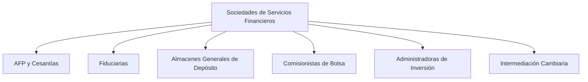

## Definición general

> Las **sociedades de servicios financieros** son entidades que **administran, gestionan o intermedian recursos de terceros**, pero **sin captar dinero del público de manera directa**, ni otorgar créditos por cuenta propia.

Su función principal es **prestar servicios financieros especializados** complementarios a la actividad de los [[Establecimientos de Crédito]], fortaleciendo el funcionamiento del mercado de valores, la inversión, los fondos y el almacenamiento de bienes.

> 💡 Están vigiladas por la **Superintendencia Financiera de Colombia (SFC)** y reguladas por el **Estatuto Orgánico del Sistema Financiero (EOSF)** y la **Ley 964 de 2005** (mercado de valores).

---

## Funciones principales

1. **Administrar recursos de ahorro o inversión** (fondos, pensiones, cesantías).  
2. **Intermediar en la compra y venta de valores** en el mercado bursátil.  
3. **Prestar servicios fiduciarios, de custodia o depósito.**  
4. **Fomentar la inversión colectiva y la gestión patrimonial.**  
5. **Brindar servicios financieros especializados** (leasing, asesoría, corretaje, etc.).

---

## Clasificación general de las sociedades de servicios financieros

| Tipo de entidad | Función principal | Ejemplo real |
|------------------|-------------------|---------------|
| **Sociedades Administradoras de Fondos de Pensiones y Cesantías (AFP)** | Gestionan los aportes obligatorios y voluntarios de los trabajadores. | Porvenir, Protección, Colfondos |
| **Sociedades Fiduciarias** | Administran bienes o recursos por cuenta de terceros mediante contratos de fiducia. | Fidubogotá, Alianza Fiduciaria, Fiducoldex |
| **Almacenes Generales de Depósito (AGD)** | Custodian mercancías y emiten certificados de depósito o bonos de prenda. | Almaviva, Depósitos de Colombia |
| **Sociedades Comisionistas de Bolsa** | Intermedian operaciones de compra y venta de valores en el mercado bursátil. | Casa de Bolsa, BTG Pactual, Davivienda Corredores |
| **Sociedades Administradoras de Inversión (SAI)** | Administran fondos de inversión colectiva (FIC) o carteras colectivas. | Credicorp Capital, Old Mutual, Skandia |
| **Sociedades de Intermediación Cambiaria y de Servicios Financieros Especiales (SICSE)** | Realizan operaciones de cambio internacional y remesas. | Giros & Finanzas, Western Union Colombia |

---

## 1. Sociedades Administradoras de Fondos de Pensiones y Cesantías (AFP)

> Administran los aportes de los trabajadores y empleadores destinados a **pensiones obligatorias, cesantías y pensiones voluntarias**.

### Funciones
- Gestionar los fondos de pensiones bajo criterios de rentabilidad y seguridad.  
- Administrar las cesantías y trasladarlas cuando el trabajador lo requiera.  
- Invertir los recursos en instrumentos financieros autorizados.  

**Ejemplo:** *Porvenir, Protección, Colfondos.*

---

## 2. Sociedades Fiduciarias

> Reciben y administran bienes o recursos de terceros **en virtud de un contrato de fiducia mercantil o encargo fiduciario**.

### Tipos comunes de fiducia
- **Fiducia de administración y pagos**  
- **Fiducia de inversión**  
- **Fiducia inmobiliaria**  
- **Fiducia en garantía**

**Ejemplo:** *Fidubogotá, Alianza Fiduciaria, Fiducoldex.*

---

## 3. Almacenes Generales de Depósito (AGD)

> Entidades que **custodian y conservan mercancías o bienes**, emitiendo a favor del depositante **certificados de depósito y bonos de prenda**, que pueden ser usados como garantía para obtener crédito.

### Funciones
- Custodia, conservación y manejo de mercancías.  
- Emisión de títulos valores respaldados en bienes depositados.  
- Control de inventarios para importadores y exportadores.

**Ejemplo:** *Almaviva, Almacafé.*

---

## 4. Sociedades Comisionistas de Bolsa

> Intermedian en la **compra y venta de valores** inscritos en el **Registro Nacional de Valores y Emisores (RNVE)** y negociados en la **Bolsa de Valores de Colombia (BVC)**.

### Funciones
- Intermediación bursátil y ejecución de órdenes de clientes.  
- Asesoría en inversiones y estructuración de portafolios.  
- Colocación de emisiones y administración de cuentas de margen.  

**Ejemplo:** *Casa de Bolsa, Davivienda Corredores, BTG Pactual Colombia.*

---

## 5. Sociedades Administradoras de Inversión (SAI)

> Se encargan de **administrar Fondos de Inversión Colectiva (FIC)**, integrados por aportes de múltiples inversionistas.

### Funciones
- Invertir los recursos en valores, títulos o instrumentos financieros.  
- Gestionar riesgos de mercado, liquidez y crédito.  
- Permitir la participación de pequeños inversionistas en el mercado de capitales.

**Ejemplo:** *Skandia, Credicorp Capital, Old Mutual.*

---

## 6. Sociedades de Intermediación Cambiaria y de Servicios Financieros Especiales (SICSE)

> Autorizadas para realizar **operaciones de cambio internacional** (compra/venta de divisas, remesas, transferencias) y otros **servicios financieros especializados**.

### Funciones
- Cambio de divisas y giros internacionales.  
- Transferencia de dinero y remesas.  
- Corresponsalía bancaria internacional.

**Ejemplo:** *Giros & Finanzas*, *Western Union Colombia.*

---

## Esquema general

