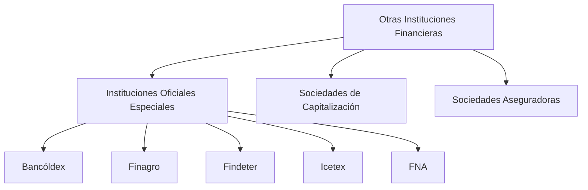

## Definición general

> Las **otras instituciones financieras** son entidades que, sin ser establecimientos de crédito ni sociedades de servicios financieros, **participan en la actividad financiera mediante operaciones especializadas**.

Su papel es **complementar el sistema financiero**, apoyando sectores estratégicos de la economía, ofreciendo productos de **ahorro, seguros, capitalización o crédito de fomento**.

> 💡 Estas instituciones pueden ser **públicas o privadas**, y están vigiladas por la **Superintendencia Financiera de Colombia (SFC)**.

---

## Clasificación general

| Tipo de entidad                              | Función principal                                                                         | Ejemplos reales                        |
| -------------------------------------------- | ----------------------------------------------------------------------------------------- | -------------------------------------- |
| **Instituciones Oficiales Especiales (IOE)** | Entidades públicas de fomento económico y social.                                         | Bancóldex, Finagro, Findeter, Icetex   |
| **Sociedades de Capitalización**             | Promueven el ahorro programado mediante títulos con sorteos y rendimientos.               | Colmena, Colpatria Capitalizadora      |
| **Sociedades Aseguradoras**                  | Ofrecen productos para la cobertura de riesgos personales, patrimoniales y empresariales. | Sura, Seguros Bolívar, Allianz, Mapfre |

---

## 1. Instituciones Oficiales Especiales (IOE)

> Son entidades del Estado que cumplen **funciones de fomento financiero y desarrollo económico**, actuando muchas veces como **bancos de segundo piso** (no prestan directamente al público, sino a través de intermediarios).

### Principales instituciones

| Entidad                             | Función principal                                                             |
| ----------------------------------- | ----------------------------------------------------------------------------- |
| **Bancóldex**                       | Financia exportaciones, innovación y competitividad empresarial.              |
| **Finagro**                         | Apoya la financiación y el desarrollo del sector agropecuario.                |
| **Findeter**                        | Promueve proyectos de infraestructura, vivienda y sostenibilidad territorial. |
| **Icetex**                          | Otorga créditos educativos y administra fondos de becas y subsidios.          |
| **FNA (Fondo Nacional del Ahorro)** | Facilita ahorro y crédito para vivienda y educación.                          |

### Características
- Financian principalmente a través de **intermediarios financieros**.  
- Su enfoque es **social y de desarrollo**, más que de lucro.  
- Se articulan con las políticas del **Ministerio de Hacienda y Crédito Público (MHCP)**.

---

## 2. Sociedades de Capitalización

> Entidades privadas que promueven el **ahorro programado** mediante títulos de capitalización, en los cuales el suscriptor realiza aportes periódicos que pueden generar rendimientos o participar en sorteos.

### Funciones
- Ofrecer productos de ahorro a largo plazo con incentivos de premio o rentabilidad.  
- Canalizar recursos hacia inversiones seguras.  
- Fomentar la educación financiera y el ahorro popular.

**Ejemplo:** *Colmena Capitalizadora, Colpatria Capitalizadora.*

### Características
- No otorgan créditos.  
- No captan recursos del público de forma generalizada.  
- Son supervisadas por la **SFC**, bajo el EOSF (Art. 38 y 39).

---

## 3. Sociedades Aseguradoras

> Son entidades que **asumen riesgos a cambio del pago de una prima**, compensando económicamente al asegurado en caso de siniestro.

### Tipos de seguros
- **Seguros de personas:** vida, salud, accidentes.  
- **Seguros generales:** incendios, vehículos, responsabilidad civil.  
- **Seguros previsionales y de pensiones:** cubren invalidez y sobrevivencia.  
- **Reaseguros:** cobertura a otras aseguradoras (compañías reaseguradoras).

**Ejemplo:** *Seguros Bolívar, Sura, Allianz, Mapfre, AXA Colpatria.*

### Funciones
- Proteger patrimonios individuales y empresariales.  
- Disminuir el riesgo financiero mediante la transferencia de riesgo.  
- Contribuir a la estabilidad económica y al mercado de capitales.

---

## Esquema general

